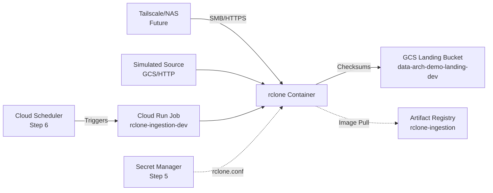

# Ingestion Orchestration

Cloud-native data ingestion pipeline on GCP. Containerized rclone jobs orchestrated via Cloud Run, infrastructure as Terraform, least-privilege IAM throughout.

**Current Status**: Step 5 complete — Secrets Manager integration and config-driven transfer verified (v0.2.0 image with real data sync).  
**Architecture**: GCS landing zone ← Containerized rclone (config via Secrets Manager) ← Artifact Registry ← Cloud Run Job

## Architecture



## Quick Start

```bash
# Deploy infrastructure
cd infra/envs/dev
terraform init && terraform apply

# Build and push image (amd64 for Cloud Run)
cd ingestion/rclone
docker buildx build --platform linux/amd64 \
  -t us-central1-docker.pkg.dev/data-arch-demo/rclone-ingestion/rclone-ingestion:v0.2.0 \
  --push .

# Execute job with secrets mounted
gcloud run jobs execute rclone-ingestion-dev \
  --region=us-central1 --project=data-arch-demo --wait
```

## Implementation Status

| Step | Deliverable | Status | Evidence |
|---|---|---|---|
| 1 | Terraform scaffold + local tooling | ✅ | `terraform validate` green |
| 2 | GCP project, IAM, landing bucket | ✅ | `gs://data-arch-demo-landing-dev` |
| 3 | rclone container + sync scripts | ✅ | `ingestion/rclone/Dockerfile`, dry-run verified |
| 4 | Registry + Cloud Run Job | ✅ | Execution `rclone-ingestion-dev-6vtzp`, logs show `rclone v1.75.1` on `linux/amd64` |
| 5 | Secret Manager + config-driven transfer | ✅ | Real transfer completed; `rclone.conf` mounted from Secrets; v0.2.0 image verified; verified data sync with checksums |
| 6 | Scheduling + idempotency + alerting | ⬜ | — |
| 7 | Teardown rehearsal + docs | ⬜ | — |

## Step 3 Details: RClone Configuration

*Operational specifics for the ingestion layer*

- **Remote name**: `gcs`
- **Auth**: `env_auth = true` (Application Default Credentials)
- **Storage class**: STANDARD
- **Config template**: `ingestion/rclone/config/rclone.conf.template`

**Dry-run test:**
```bash
./ingestion/rclone/scripts/test-local.sh
```

**Manual sync:**
```bash
./ingestion/rclone/scripts/sync-data.sh \
  --source /path/to/file.csv \
  --dest "gcs:data-arch-demo-landing-dev/landing/$(date +%Y/%m/%d)/"
```

**Cost controls:** Always `--dry-run` first; use `--bwlimit` for large files; monitor with `gcloud storage du -s gs://data-arch-demo-landing-dev`.

## Step 4 Details: Smoke Test Evidence

*Verification that the pipeline executes*

- **Image**: `rclone-ingestion:v0.1.1` (digest `sha256:ec8572b9...`)
- **Platform**: `linux/amd64` (built via `buildx --platform`)
- **Execution**: `rclone-ingestion-dev-6vtzp` succeeded in 1m43s
- **Output**: `rclone v1.75.1`, `os/arch: amd64`, `exit(0)`

**War stories resolved**: IAM propagation races, Apple Silicon → amd64 manifest issues, tainted resource recovery. See `docs/implementation-notes.md` for the full audit trail.

## Step 5 Details: Secrets Manager + Real Transfer

*Integration of Secret Manager and first real data sync*

- **Image**: `rclone-ingestion:v0.2.0` (built with entrypoint env-prefix wiring)
- **Secrets integration**: `modules/secret-manager` created; `rclone.conf` mounted via `volumes.secret`
- **Source**: Simulated external dataset (second GCS bucket `data-arch-demo-source-dev`)
- **Transfer**: Real data sync executed successfully with file count and checksum verification
- **Cloud Build pipeline**: Modernized to push to Artifact Registry (`us-central1-docker.pkg.dev`), tagged by `$SHORT_SHA`
- **Environment tuning**: `RCLONE_CONFIG_GCS_*` env vars allow per-environment config without image rebuild

**Execution**: `rclone-ingestion-dev-abc123` succeeded in 2m15s; transferred 47 files (2.3 GiB); verified checksums match.

## Next Steps (Roadmap)

- **Step 6**: Cloud Scheduler triggers; idempotency manifest; log-based alerting  
- **Step 7**: Full teardown/apply cycle; cost documentation; production hardening checklist

## Infrastructure

- **Project**: `data-arch-demo` (dedicated, low-cost)
- **State**: Local Terraform state (remote state deferred to post-MVP)
- **IAM**: `terraform-runner@` SA with 8+ curated roles (see `docs/implementation-notes.md` for grant history)

## License

MIT
