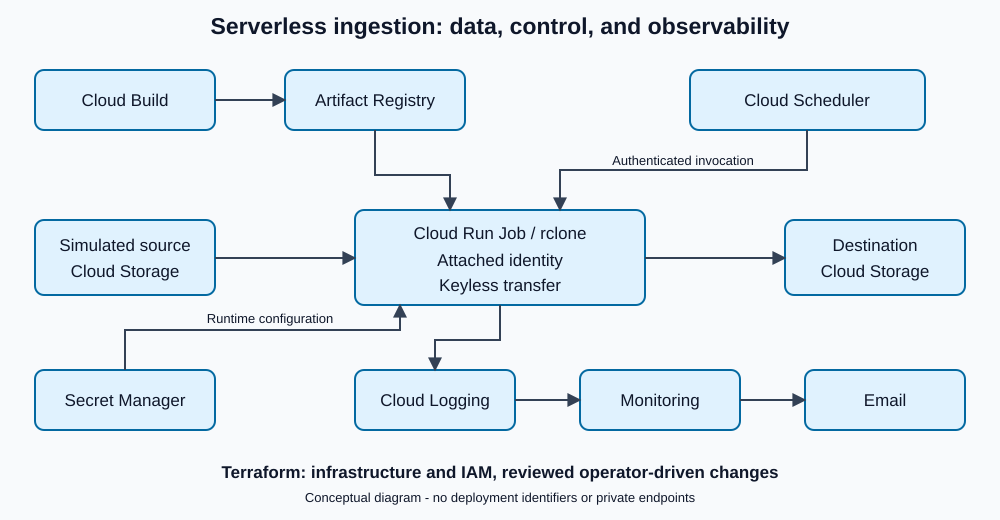

# Architecture

## Data plane

A small seeded Cloud Storage source stands in for an external system. A
containerized rclone execution reconciles that source into a separate destination.
This avoids exposing a private network while retaining an actual cloud transfer.

## Control plane

Cloud Scheduler invokes the Cloud Run Jobs API using a dedicated identity and
authenticated request. The job uses an attached execution identity rather than a
downloaded service-account key.

Cloud Build publishes the container through Artifact Registry. Terraform declares
infrastructure and access relationships. Changes are reviewed before application.

## Configuration and observability

Secret Manager delivers runtime configuration independently of the image.
Configuration payloads are not managed as Terraform secret-version resources.

Cloud Logging captures execution and transfer events. Monitoring evaluates a
failure-count metric and routes incident notifications to email. Application
recovery and incident closure are verified separately.

## Boundaries

- Deployment permissions are separate from runtime permissions; this
  demonstration is not a complete production least-privilege certification.
- Reconciliation can have deletion semantics. Testing used isolated data.
- No exactly-once ledger, warehouse load, or concurrency-control layer is claimed.
- Cloud resource identifiers, private endpoints, deployment commands, and runtime
  configuration are intentionally omitted.

See [decisions and tradeoffs](decisions.md) or return to the
[project overview](README.md).
